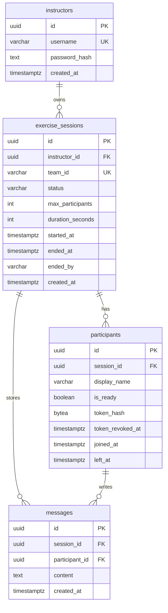

# Cyberxercise Data Model (MVP)

PostgreSQL schema for Cyberxercise.

## Mermaid ERD

## Tables

### instructors
- `id` UUID PK
- `username` unique, not null
- `password_hash` not null
- `created_at` not null

### exercise_sessions
- `id` UUID PK
- `instructor_id` FK -> instructors.id
- `team_id` unique, not null
  - exactly 6 chars
  - allowed alphabet: `ABCDEFGHJKLMNPQRSTUVWXYZ23456789`
  - input normalized by `strip()` + `upper()`
- `status` enum-like string: `lobby` | `running` | `ended`
- `max_participants` int not null default 10
- `duration_seconds` int nullable
- `started_at` timestamptz nullable
- `ended_at` timestamptz nullable
- `ended_by` nullable string: `instructor` | `system`
- `created_at` not null

Recommended constraints:
- `CHECK (max_participants BETWEEN 1 AND 10)` (MVP max)
- `CHECK (status IN ('lobby','running','ended'))`
- `CHECK (team_id ~ '^[A-HJ-NP-Z2-9]{6}$')`

### participants
- `id` UUID PK
- `session_id` FK -> exercise_sessions.id
- `display_name` not null
- `is_ready` not null default false
- `joined_at` not null
- `left_at` nullable

Participant auth (MVP addition required for no-login participants):
- `token_hash` BYTEA not null
  - computed as `HMAC-SHA256(token, PARTICIPANT_TOKEN_PEPPER)`
  - never store raw token
  - recommend `CHECK (octet_length(token_hash) = 32)`
- `token_revoked_at` timestamptz nullable

Uniqueness:
- `UNIQUE(session_id, display_name)`
- `UNIQUE(token_hash)` (or `UNIQUE(session_id, token_hash)` if you ever scope tokens per session)

### messages
- `id` UUID PK
- `session_id` FK -> exercise_sessions.id
- `participant_id` FK -> participants.id
- `content` text not null
- `created_at` timestamptz not null

Indexes (recommended):
- `messages(session_id, created_at)`

## Session Lifecycle Notes
- `lobby`:
  - participants may join/leave
  - participants may ready/unready
- `running`:
  - participants may submit messages
  - joining is not allowed
- `ended`:
  - no joins, no ready changes, no new messages
  - token checks should fail (treat as expired) once the session ends
